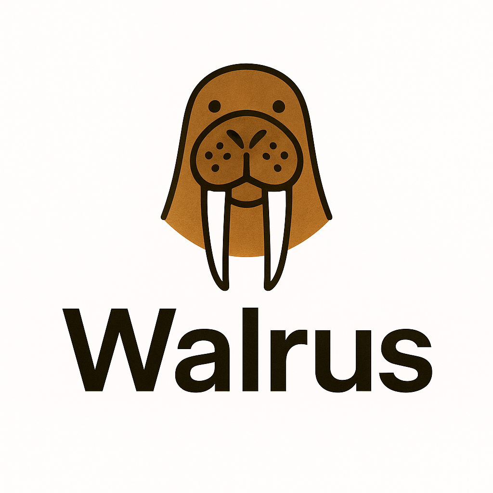
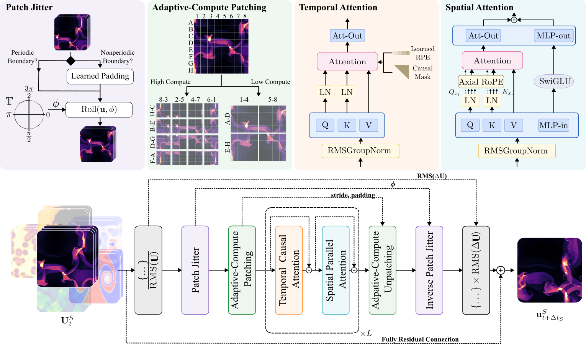

<!--  -->
<!--  -->

# Walrus: A Cross-domain Foundation Model for Continuum Dynamics
<div align="center">

[](https://opensource.org/licenses/MIT)
[](https://pytorch.org/)
[](https://arxiv.org/abs/2511.15684)
[](https://huggingface.co/polymathic-ai/walrus)

[Getting Started](#getting-started) • [Tutorials](#tutorials) • [Model Overview](#model-overview) 

</div>

---

## Overview
<div align="center">
    
</div>

This repo is built for training and evaluating Walrus, a multi-domain foundation model for continuum dynamics trained primarily on fluid-like behaviors.
Walrus was trained on 19 different physical scenarios spanning 63 physical variables in both 2 and 3D. Walrus utilizes new tools for adaptive computation and improved stability
in order to achieve accurate long-term rollouts while co-adapting sampling and distribution to improve training throughput despite handling varying dimensions, resolutions, and
aspect ratios.

## Getting Started

### Installation

Clone the repository and install locally. Requirements are documented in the pyproject.toml file. 

Most of the data used in experiments is from [the Well](https://github.com/PolymathicAI/the_well),
so it may be easier to get started if you have the Well at least partially available. 

```bash
git clone git@github.com:PolymathicAI/walrus.git
cd walrus
pip install .
```
By default, this repository does not include all dependencies of non-Walrus models. To install optional dependencies,
instead run:

```bash
pip install .[external_modes]
```
## Running Experiments

This project is orchestrated using [Hydra](https://github.com/facebookresearch/hydra) to give users modular access over 
various model components, datasets, and runtime options. All training was done in slurm environments. Example invocations
for training, validating, and finetuning Walrus models can be found in [walrus/run_scripts](walrus/run_scripts).

Most of these use relative paths and slurm. For example, one would launch the training script with:
```bash
cd /path/to/thisfolder/walrus/walrus
sbatch run_scripts/pretrain_example_distributed_walrus.sh
```
Local invocations also available for smaller training and validation runs.

## Tutorials

To help get you started, we include a set of demo notebooks. These are:

- [Transforming data into Well Format](demo_notebooks/walrus_example_0_ConvertingDataIntoWellFormat.ipynb) - Since our repository largely uses structures from the Well, we include a guide 
to transforming data so it can be used easily within this repository. 
- [Running Walrus](demo_notebooks/walrus_example_1_RunningWalrus.ipynb) - This notebook walks through the basics of how to use Walrus both with Well data and with external data.

If you already have a local copy of the Well, you can skip straight to example 1. However, if you do not, it's recommended to follow example 0 to get some data to use. We also include several example run scripts for training and validation, both using slurm and torchrun for distribution and just running single-GPU code. 

## Model Overview

### Architecture

Walrus uses and encoder-processor-decoder structure. Encoder/decoder are hMLPs/transposed hMLPs using stride modulation to dynamically adjust the
internal resolution. The processor consists of blocks containing factorized space and time attention. 

### Patch Jittering

Walrus suppressed the growth of long-run instabilities through the use of *patch jittering*. Patch jittering involves randomly translating the reference frame (with padding for boundaries)
before each step. While the paper goes into more theoretical detail on why this works, the core idea is that the specific downsampling pattern leads to predictable accumulation
of error and that randomizing this process can help alleviate this pathology.

### Adaptive Compute

To handle varying compute budgets and problem complexities, we also employ [stride modulation](https://arxiv.org/pdf/2507.09264) to allow users to adjust
their downstream resolution. During pretraining, this was used to keep internal resolution fairly consistent (32/33 per dim in 2D, 16/17 in 3D). In this approach, the downsampling
layers of the encoder/decoder will dynamically adjust their stride based on a target internal resolution. 

### Efficient Training

Heterogeneous data can easily lead to training bottlenecks as many distribution primitives require regular syncing. Our approach
adjusts downsampling to ensure consistent token counts, but also adjust context length and batch size to minimize gaps. This isn't 
enough to completely eliminate discrepencies, so we must also adjust our sampling strategy to be aware of where these dead cycles can emerge.
We implement sampling such that when training with HSDP, all nodes within a sharding group are forced to sample the same data source. This
balances batch diversity and efficiency. 

## License
This project is licensed under the MIT License - see the [LICENSE](LICENSE) file for details.

## Contact

- **Issues**: [GitHub Issues](https://github.com/PolymathicAI/walrus/issues)

For other queries, please reach out to the corresponding author: mmccabe@flatironinstitute.org. 

## Acknowledgements

Walrus is built by [Polymathic AI](https://polymathic-ai.org/) as part of our mission of advancing the frontier of AI for scientific application. Polymathic AI gratefully acknowledges funding from the Simons Foundation and Schmidt Sciences, LLC. This work was performed with compute from the Scientific Computing Core, a
division of the Flatiron Institute, a division of the Simons Foundation and from the National AI Research Resource Pilot, including support from NVIDIA
and NVIDIA’s DGX Cloud product which includes the NVIDIA AI Enterprise Software Platform.

## Citing Walrus

Please use the following citation for Walrus:

```
@misc{mccabe2025walruscrossdomainfoundationmodel,
      title={Walrus: A Cross-Domain Foundation Model for Continuum Dynamics}, 
      author={Michael McCabe and Payel Mukhopadhyay and Tanya Marwah and Bruno Regaldo-Saint Blancard and Francois Rozet and Cristiana Diaconu and Lucas Meyer and Kaze W. K. Wong and Hadi Sotoudeh and Alberto Bietti and Irina Espejo and Rio Fear and Siavash Golkar and Tom Hehir and Keiya Hirashima and Geraud Krawezik and Francois Lanusse and Rudy Morel and Ruben Ohana and Liam Parker and Mariel Pettee and Jeff Shen and Kyunghyun Cho and Miles Cranmer and Shirley Ho},
      year={2025},
      eprint={2511.15684},
      archivePrefix={arXiv},
      primaryClass={cs.LG},
      url={https://arxiv.org/abs/2511.15684}, 
}
```

